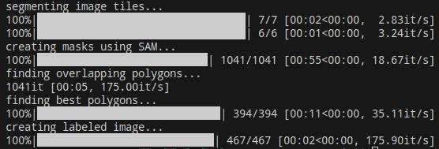
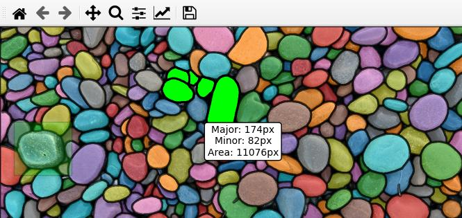
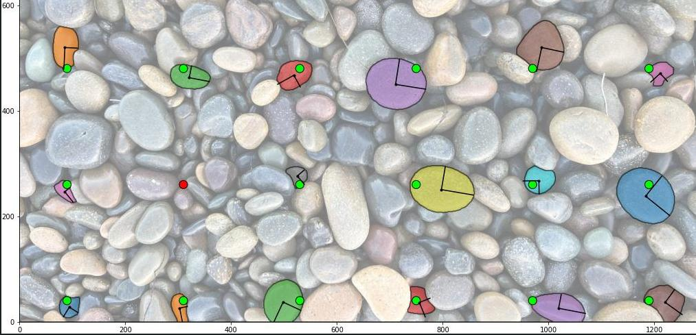
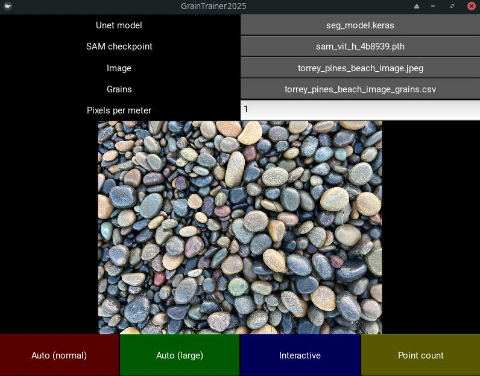

# segmenteverygrain

## Description

`segmenteverygrain` is a Python package that aims to detect sedimentary grains (or grain-like objects) in images, created by [Dr. Zoltan Sylvester](https://www.beg.utexas.edu/people/zoltan-sylvester) at UT Austin. Please see the [original repo](https://github.com/zsylvester/segmenteverygrain) for details and guidance. This project is a fork of the original, and is in no way approved or supported by the creator(s), maintainer(s), or sponsors of segmenteverygrain.

This fork was independently created to support upcoming work by [Dr. Emma Lodes](https://www.emmalodes.com/) at Arizona State University. It is not approved or supported by Arizona State University, any employees or representatives thereof, or anyone other than the creator of this fork. 

This project is in active development. Utility, accuracy, and safety are not guaranteed. Use this code at your own risk.

## Features
This unofficial fork attempts to build on the core features of segmenteverygrain by improving user interactivity and adding auxiliary features.

### Automated grain detection

The original automated grain detection and segmentation process as laid out in [Segment_every_grain.ipynb](segmenteverygrain/Segment_every_grain.ipynb) has not been significantly modified except for how results are saved. The notebook itself has not been modified at all.

#### Usage
 The original notebook (above) can be executed directly, but results will not be wholly compatible with the features below. Compatible results can be generated by running the automatic detection and segmentation process through the GUI, or by editing the [automatic.ipynb](automatic.ipynb) script for appropriate input/output locations and running it directly. The script only implements the normal image processing method from the notebook, while the GUI includes both the normal and large-image methods.

### Interactive interface

The original manual editing interface has been modified to facilitate:

- Increased FPS (using blitting), especially with high grain counts
- Large images, by downscaling for display (while operating on the full-resolution image)
- Using the same interface to create, delete, merge, and measure grains
- Convert pixels to meters using a given scale length or by measuring a scale bar in the image
- More control over grain detection, including a selection box and arbitrary number of foreground/background prompts
- A toggleable info box to display information about the last-selected grain
- Undoing the most recently-created grain
- Minor bugfixes like not resetting the zoom level when creating a grain

#### Usage
Run the new interactive interface through the GUI or directly using the [interactive.ipynb](interactive.ipynb) notebook, editing it for appropriate input and output locations. Navigation within the interface is described in the [matplotlib documentation](https://matplotlib.org/stable/users/explain/figure/interactive.html#interactive-navigation). Additional controls are:

- `Left click`: Select/unselect existing grain or place foreground prompt for grain detection
- `Shift + left click/drag`: Create or adjust box prompt for grain detection
- `Right click`: Place background prompt for grain detection
- `Middle click`: Display measurement information about the indicated grain
- `Middle click + drag`: Measure scale bar to calibrate pixels per meter
- `Control`: Hold to temporarily hide selected grains
- `Escape`: Remove all prompts and unselect all grains
- `c`: Use selection box and/or foreground/background prompts to detect a grain
- `d`: Delete selected (highlighted) grains
- `m`: Merge selected grains (must be touching)
- `z`: Delete the most recently-created grain

### Automated grid count

The results of segmenteverygrain can be used to simulate the results of a manual grid count. This provides less information than segmentation of a complete image, but is more comparable to traditional methods. Currently there is no fine-grain cutoff threshold and points not directly landing on a grain are simply excluded.

#### Usage
After using segmenteverygrain to generate a grain info csv (ending in _grains.csv), generate a grid count through the GUI or by directly editing and running [grid_count.ipynb](grid_count.ipynb).

### Graphical interface

The core functions of segmenteverygrain have been wrapped into an optional, experimental GUI in order to provide a familiar user experience. Features include:

- Automated grain detection and segmentation, mostly following the process laid out in the original [Segment_every_grain.ipynb](segmenteverygrain/Segment_every_grain.ipynb) Jupyter Notebook
- Large-image grain detection and segmentation, again per the original notebook
- Manually-guided detection/editing of grains using the improved interactive interface
- Grid count simulation
- Unit conversion

#### Usage
The GUI was created using Kivy, which adds additional dependencies. Kivy and matplotlib integration (required) can be installed using `pip install kivy kivy_garden.matplotlib --extra-index-url https://kivy-garden.github.io/simple/`. Refer to the [official Kivy site](https://kivy.org/doc/stable/api-kivy.garden.html) for more details.

Run the GUI from [segment_gui.py](segment.py), use the buttons at top to load an image and/or a csv with grain data that was generated by another method, and access the desired functions from the toolbar on the bottom. If you want to modify the GUI itself, note that its layout is defined in [segment.kv](segment.kv)

## Current status
This fork of segmenteverygrain is tentatively feature-complete for its intended usage, though questions and suggestions are always welcome via the issue queue.

Current work is focused on bugfixing and documentation, as well as upstreaming any features that the creator(s) of the original project might find useful.
